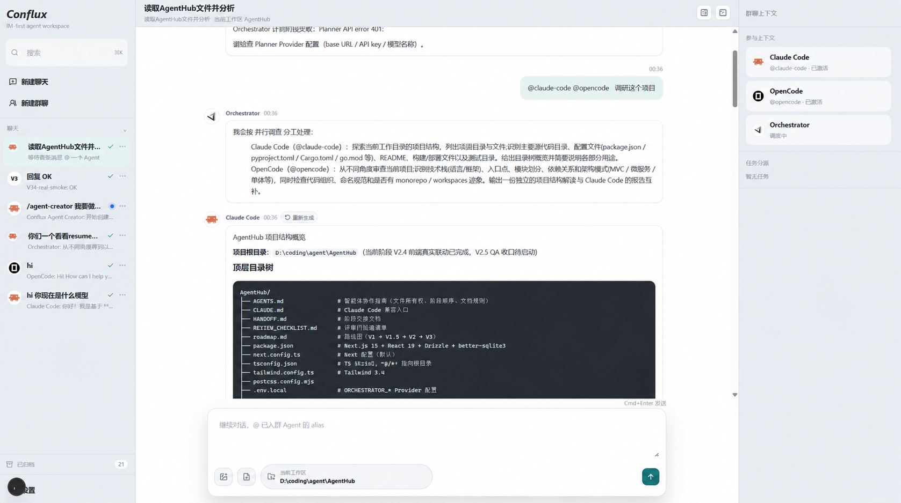
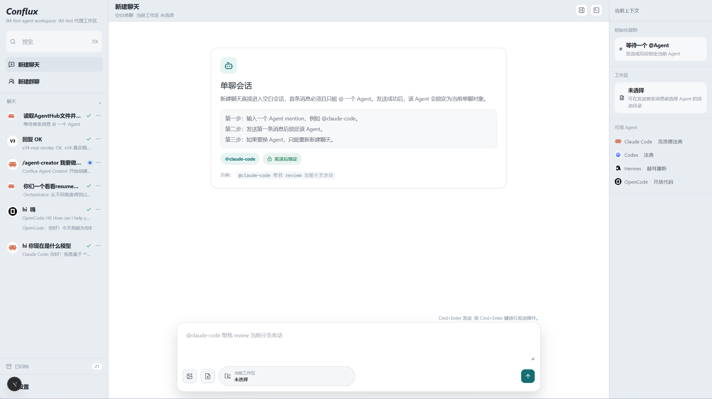
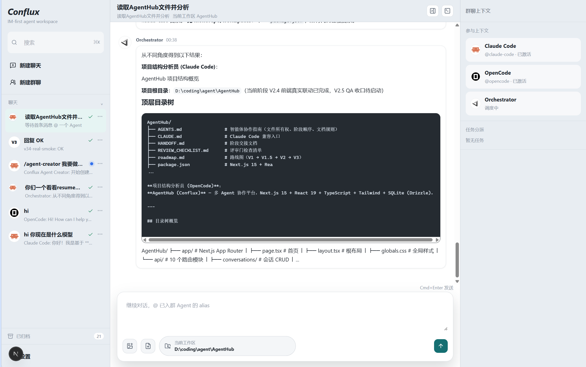
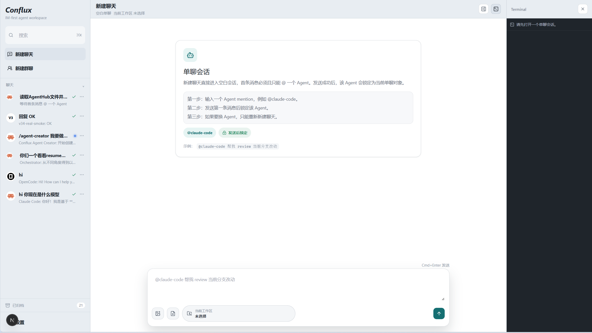

# Conflux

> 群聊即工作流：多 Agent 协作的新界面



Conflux 把 Claude Code、Codex、Hermes、OpenCode 这些 AI 编程 Agent 装进一个 IM 聊天窗口。你不用再为每个 Agent 单开一个终端 —— 想让 AI 帮你干活，就在群里 @ 它；想让几个 AI 一起干一件复杂的事，就把它们都拉进同一个群，Conflux 在背后拆活、派活、收活。

你面对的始终是消息流、代码块和产出文件，不是一堆孤立的 shell。

## 预览

### 单聊 · 三栏 IM 体验


### 群聊 · Orchestrator 调度多 Agent


### 群聊 · `/agent-creator` 对话式自建 Agent


### 群聊 · 内嵌 PTY Terminal


## 核心特性

### 1. 多 Agent 统一入口

Conflux 不绑定单一 Agent 厂商。`lib/adapters/` 把不同的 Agent 运行时抽象成同一套契约，切换 Agent 就像切换聊天对象，不切换终端。

```typescript
type AgentAdapter = {
  platform: AgentPlatform;
  capabilities: AdapterCapabilities;   // supportsApproval / supportsChoice / …
  healthcheck(): Promise<AdapterHealth>;
  run(params: AdapterRunParams): AsyncIterable<AgentEvent>;
};
```

| Adapter | 鉴权 / 启动 | 类型 |
| --- | --- | --- |
| Claude Code（`claude-code.ts`） | 本机 CLI / OAuth | 内置 |
| Codex / Hermes / OpenCode | 本机 CLI（OpenCode 可用 `AGENTHUB_OPENCODE_COMMAND` 覆盖路径） | 内置 |
| 自建 Claude Code（`claude-code-sdk.ts`） | 走 Anthropic 兼容 Provider，per-run env 注入 | 自建 |
| `fake` / `fallback` | 离线或 CLI 缺失时兜底 | 兜底 |

每个 Agent 在 UI 里就是聊天列表里的一个"联系人"，有头像、名称、能力标签。本机 CLI 没就绪时，UI 通过 `healthcheck()` 给提示；适配器事件统一成 `AgentEvent` 流（`text_delta` / `artifact_created` / `interaction_required` / `run_status` / `message_done` …），前端不需要为不同 Agent 写不同渲染逻辑。

### 2. 自研 Orchestrator —— 群聊的真实动力

> 这是整个项目最关键的一环。群聊不是一个"@ 多个 Agent 看谁先回"的玩具，而是一条**可解释、可调度**的协作工作流。

我们没有套用现成的 Agent 框架。`lib/orchestrator/` 是仓库内自研的一套明确分工 —— 每一步都能指到具体文件：

```text
   用户在群聊 @Orchestrator
            │
            ▼
   ┌────────────────┐
   │  Planner       │   自研 HTTP 客户端 → Provider（openai_compatible / anthropic）
   └───────┬────────┘
           │  拆解为子任务（含可澄清的 Choice 交互）
           ▼
   ┌────────────────┐
   │  Scheduler     │   lib/orchestrator/scheduler.ts
   └───────┬────────┘   把子任务排成 DAG，决定串/并行
           │
           ▼
   ┌────────────────┐
   │  Invoker       │   复用单聊的 runs.ts
   └───────┬────────┘   for each sub-task:
           │            startAgentRun({ conversationAgentId, orchestratorTaskId })
           │              → 复用适配器 run() → 复用单聊的 SSE 流
           ▼
   ┌────────────────┐
   │  Evaluator     │   lib/orchestrator/evaluator.ts
   └───────┬────────┘   验证子任务产出 / 产物落库
           │
           ▼
   ┌────────────────┐
   │  Aggregator    │   lib/orchestrator/aggregator.ts
   └───────┬────────┘   把子 Agent 产出汇成一条群聊消息
           │
           ▼
       群聊消息流
```

| 角色 | 职责 | 关键实现 |
| --- | --- | --- |
| **Planner** | 接收群聊内用户消息，拆解为子任务 | 自研 HTTP 客户端，调用 Provider 中 `openai_compatible` 或 `anthropic` 协议 |
| **Scheduler** | 把子任务排成 DAG，决定串/并行 | `lib/orchestrator/scheduler.ts` |
| **Invoker** | 真正发起每个子 Agent 的 run | 复用单聊的 `runs.ts`，调 `startAgentRun({ conversationAgentId, orchestratorTaskId })` |
| **Evaluator** | 验证子任务产出（产物、状态、白盒检查） | `lib/orchestrator/evaluator.ts` |
| **Aggregator** | 把子 Agent 产出汇成一条群聊消息 | `lib/orchestrator/aggregator.ts` |

### 3. IM 核心体验 —— 三栏聊天工作台

Conflux 的核心交互范式是 IM 聊天 —— 整个产品就是一套三栏 IM 界面：会话列表 / 消息流 / 上下文面板。

- **三栏布局**
  - **左**：会话列表，按最近活跃排序；新建 / 置顶 / 归档 / 搜索
  - **中**：消息流，Markdown + 代码块（Shiki 高亮）+ 图片 + 附件 + 产物卡片，inline 渲染
  - **右**：上下文面板，当前 Agent 状态、Todo 进度、产出文件列表
- **两种模式**
  - **单聊**：1v1 与一个 Agent 对话，适合明确任务。首条 `@` 锁定 Agent，后续消息只能跟它
  - **群聊**：多 Agent 群聊，通过 `@agent` 初始化成员，或在消息流里 `@Orchestrator` 触发调度
- **消息类型与产物内联**
  - 文本 / Markdown / 代码块 / 图片 / 文件附件
  - 产物卡片：`artifact_created` 事件触发，可展开预览
  - Approval / Choice 内联卡片（Agent 运行中需要你确认时 inline 弹出）
- **消息操作**：停止生成、重新生成（最近一条 assistant）、复制代码、展开 / 收起产物
- **上下文管理**：每次发送自动带上完整聊天历史；适配器按 session 复用，多轮迭代不丢上下文

### 4. 自建 Agent + 两个 Built-in Skill

Conflux 把"创建一个新 Agent"和"创建一个新 Skill"做成了**两个 Built-in Skill** 本身 —— 你可以在单聊或群聊的消息流里直接调用它们：

| Built-in Skill | 作用 | 怎么调 |
| --- | --- | --- |
| `/agent-creator` | 对话式创建一个新的 Agent（System Prompt、工具集、permission_mode、Provider 绑定、头像） | 消息流里输入 `/agent-creator` |
| `/skill-creator` | 创建一个可复用的 Skill，并把它挂到任意 Agent 上 | 消息流里输入 `/skill-creator` |

```text
   /agent-creator
        │
        ▼
   引导式填写：name / system_prompt / platform / permission_mode / provider_id / avatar
        │
        ▼
   写入 agents 表（is_builtin = false）
        │
        ▼
   新 Agent 出现在聊天列表，可以 @ 进群聊 → Orchestrator 把它当一个执行节点
```

```text
   /skill-creator
        │
        ▼
   引导式填写：name / description / 触发词 / 内容 / 挂到哪个 Agent
        │
        ▼
   写入 skills + agent_skills 表
        │
        ▼
   挂载生效：对应 Agent 收到匹配触发词的消息时自动展开 Skill
```

新建的 Agent 可以直接 `@` 进群聊，被 Orchestrator 当成一个**可调度的执行节点**；新建的 Skill 可以被挂到任意 Agent 上扩展能力。**自建 Agent 与内置 `@claude-code` 走的是不同 adapter**（`claude-code-sdk.ts` vs `claude-code.ts`），互不覆盖。

**Provider 约束**（仅当自建 Agent 的 `platform = claude_code`）：

- 创建 / 编辑时**只能**选择 `protocol = anthropic` 的 Provider
- 选 OpenAI 兼容 Provider 会被 UI 拦截并提示：*「Claude Code 自建 Agent 须使用 Anthropic 兼容 API」*
- **不做**本地协议代理把 OpenAI Provider 转成 Anthropic 给 Claude Code 用
- 内置 `@claude-code` 单聊仍走本机 Claude Code 默认能力，**不**因自建 Agent 的 Provider 绑定而被覆盖

### 顺带：本机优先

一个 Node 进程承担 UI + API + SSE；SQLite 默认落在本机；`npm run dev` 起服务，浏览器开 `localhost:3000` 即可。还附带可嵌的 PTY Terminal（`node-pty` + `xterm.js`），会话工作区可一键开终端 —— 适合 Agent 跑起来后顺手再开 shell 校验。

## 技术栈

| 层 | 选型 |
| --- | --- |
| 应用 | Next.js 15（App Router）+ TypeScript strict |
| UI | React 19 + Tailwind CSS + shadcn 风格组件 |
| 数据 | SQLite（`better-sqlite3`）+ Drizzle ORM |
| 实时 | SSE（主通道）+ WebSocket（仅 PTY Terminal） |
| 进程集成 | `node-pty` + `@xterm/xterm` |
| Agent 接入 | `@anthropic-ai/claude-agent-sdk` + `child_process`（CLI） |
| 协议 | `@agentclientprotocol/sdk`（ACP） |
| 图标 | `@lobehub/icons`、`lucide-react` |

## 快速开始

### 前置依赖
- Node.js 20+
- 至少一个 Agent CLI（本机登录态独立管理，互不耦合）：

  ```bash
  # 推荐：Claude Code
  npm i -g @anthropic-ai/claude-code

  # 可选：Codex / Hermes / OpenCode 各自按官方方式安装
  ```

### 安装与运行

```bash
git clone https://github.com/<your-username>/AgentHub.git
cd AgentHub
npm install
npm run dev
```

打开 <http://localhost:3000>，在左侧 **+ 新建对话** → 选单聊 → 选一个 Agent → 发送第一条消息。

### 可选环境变量（`.env.local`）

```bash
AGENTHUB_DB_PATH=./data/conflux.db          # SQLite 路径
AGENTHUB_ENABLE_TERMINAL=1                  # 启用 PTY Terminal
AGENTHUB_OPENCODE_COMMAND=/path/to/opencode # 覆盖 OpenCode CLI 路径
AGENTHUB_ADAPTER_MODE=fake                  # 调试：全局走 fake adapter
```

### 常用命令

```bash
npm run dev        # 启动开发服务
npm run build      # 生产构建
npm run typecheck  # tsc --noEmit
```

## 项目结构

```text
AgentHub/
├── app/                       # Next.js App Router
│   ├── api/                   #   Route Handlers
│   │   ├── conversations/     #   会话 CRUD + SSE stream
│   │   ├── messages/          #   消息发送 / 重新生成 / 停止
│   │   ├── interactions/      #   Approval / Choice respond
│   │   ├── providers/         #   Provider 增删改查
│   │   ├── orchestrator/      #   编排服务 HTTP
│   │   ├── planner/           #   Planner 调试
│   │   ├── skills/            #   Skill 列表 / 调用
│   │   ├── agent-creator/     #   /agent-creator skill
│   │   ├── skill-creator/     #   /skill-creator skill
│   │   └── terminal/          #   PTY 一次性 token
│   ├── layout.tsx
│   └── page.tsx
├── components/                # UI 组件（shell / chat / context / settings / agents）
├── lib/
│   ├── adapters/              # Claude Code / Codex / Hermes / OpenCode / 自建 SDK
│   ├── conversations/         # 会话服务、runs、SSE stream-bus
│   ├── db/                    # Drizzle schema + SQLite 连接
│   ├── interactions/          # Approval / Choice 桥接 + run-bridge
│   ├── orchestrator/          # Planner / Scheduler / Invoker / Evaluator / Aggregator
│   ├── providers/             # 多协议 LLM API 配置
│   ├── skills/                # agent-creator / skill-creator / runner
│   ├── agents/                # mention 解析
│   ├── mock/                  # 群聊静态 mock
│   └── terminal/              # WebSocket + node-pty
├── docs/
│   ├── design/                # PRD / 技术设计 / API 契约 / 评审清单 / 实施计划
│   └── state/                 # TODO / TOFIX 池
├── public/assets/             # 演示截图
├── AGENTS.md                  # AI 协作规范入口
├── roadmap.md                 # 阶段路线图
└── HANDOFF.md                 # 当前阶段交接
```

## 路线图

接下来要做的事：

- **桌面端**：用 Electron 打包可安装的桌面应用，主进程拉起 Next 服务并管理 Agent 子进程，关窗即退出
- **移动端**：轻量 IM 体验，查看对话、审批确认、产物预览
- **多用户协作 / 云端部署**：从 SQLite 切到 PostgreSQL，支持团队服务器部署和多人共享库

## 文档

- 产品需求：[`docs/design/prd初版.md`](./docs/design/prd初版.md)
- 课题要求：[`docs/design/要求.md`](./docs/design/要求.md)
- 技术设计：[`docs/design/TECH_DESIGN.md`](./docs/design/TECH_DESIGN.md)
- API 契约：[`docs/design/API_CONTRACT.md`](./docs/design/API_CONTRACT.md)
- 评审清单：[`docs/design/REVIEW_CHECKLIST.md`](./docs/design/REVIEW_CHECKLIST.md)
- 阶段实施计划：[`docs/design/ExecutePlan/`](./docs/design/ExecutePlan/)
- 阶段 TODO / TOFIX：[`docs/state/`](./docs/state/)
- AI 协作规范：[`AGENTS.md`](./AGENTS.md)
- 交接文档：[`HANDOFF.md`](./HANDOFF.md)

## 致谢

- [@anthropic-ai/claude-agent-sdk](https://www.npmjs.com/package/@anthropic-ai/claude-agent-sdk) · [ACP SDK](https://www.npmjs.com/package/@agentclientprotocol/sdk)
- [Next.js](https://nextjs.org/) · [Tailwind CSS](https://tailwindcss.com/) · [shadcn/ui](https://ui.shadcn.com/)
- [Drizzle ORM](https://orm.drizzle.team/) · [better-sqlite3](https://github.com/WiseLibs/better-sqlite3)
- [xterm.js](https://xtermjs.org/) · [node-pty](https://github.com/microsoft/node-pty)
- [LobeHub Icons](https://github.com/lobehub/lobe-icons)


## License

MIT
